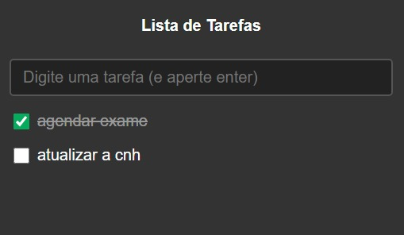

# 🚀 Início JavaScript

Este foi meu primeiro contato prático com JavaScript 💛 Pela B7Web
Um projeto simples, mas muito importante para construir minha base em programação.

---

## 📚 Sobre

Este repositório marca o início da minha jornada com JavaScript, onde comecei a entender como a linguagem funciona na prática.

Aqui dei meus primeiros passos saindo da teoria e escrevendo código de verdade.

---

## 🛠️ Tecnologias utilizadas

- HTML  
- CSS  
- JavaScript  

---

## 🎯 O que aprendi

- Como estruturar um projeto simples  
- Sintaxe básica do JavaScript  
- Variáveis e tipos de dados  
- Condicionais  
- Funções  
- Lógica de programação  

---

## Demonstração

  

